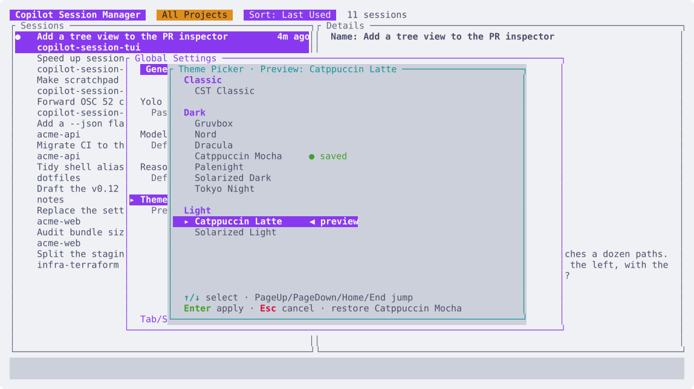

# copilot-session-tui

A terminal user interface for managing GitHub Copilot CLI sessions. Browse, search, filter, rename, and resume sessions — all from a lightweight TUI that works over SSH.


<table>
<tr>
<td width="50%">


**Multiplexer** — attach a session as a pane and keep a scratchpad, a shell, and the picker one keystroke away.

</td>
<td width="50%">


**GitHub inspector** — read an issue, pull request, or discussion without leaving the session.

</td>
</tr>
</table>

## Features

- **Full session list** — see ALL your Copilot sessions with virtual scrolling
- **Project filter** — filter sessions by working directory (auto-detects current project)
- **Fuzzy search** — find sessions by name, project, or ID
- **Favorites** — pin frequently used sessions to the top of the unfiltered view
- **Session scratchpads** — keep persistent notes with lightweight text editing
- **Session terminals** — run a persistent shell in the selected session's directory
- **Session details** — preview edited files, last message, and session stats
- **Resume** — press Enter to launch `copilot --resume` directly
- **Isolated sessions** — press `N` to create a branch-backed Git worktree before launching Copilot
- **Multiplexer** — optionally run sessions as panes inside CST, tmux-style, instead of handing over the terminal
- **Rename** — rename sessions inline with `r`
- **Safe cleanup** — delete TUI-created worktrees with dirty-worktree and unmerged-branch protection
- **Self-update** — checks GitHub Releases in the background and installs updates from the TUI
- **Sort** — cycle through sort orders (last used, created, name, project)
- **Active detection** — see which sessions are currently in use

## Installation

Install the latest release with one command. The installer places CST in a user-owned
directory, adds it to `PATH`, and configures the `cst` shell function.

**PowerShell (Windows x64):**

```powershell
irm https://raw.githubusercontent.com/tupini07/copilot-session-tui/main/install.ps1 | iex
```

**Bash (Linux x64):**

```bash
curl --proto '=https' --tlsv1.2 -fsSL https://raw.githubusercontent.com/tupini07/copilot-session-tui/main/install.sh | bash
```

**Zsh (Linux x64):**

```zsh
curl --proto '=https' --tlsv1.2 -fsSL https://raw.githubusercontent.com/tupini07/copilot-session-tui/main/install.sh | zsh
```

PowerShell installs to
`%LOCALAPPDATA%\Programs\copilot-session-tui\bin`; Bash and Zsh install to
`~/.local/bin`. Profile changes are enclosed in `copilot-session-tui` markers and are
not duplicated when the installer is run again. Restart the shell after installation,
then run `cst`. Set `CST_NO_SHELL_INIT=1` before running an installer to install only
the binary without changing a shell profile.

The prebuilt releases currently support Windows x64 and Linux x64. All installations
require [GitHub Copilot CLI](https://github.com/github/copilot-cli) 1.0.51+, which is when
`--session-id` arrived. CST names each new session itself so that a session's
scratchpad, terminal, and panel layout can be bound to it from the moment it starts.
Copilot CLI 1.0.82+ is recommended for the optional authoritative lifecycle hooks.

To uninstall, remove the managed `copilot-session-tui` block from your shell profile
and delete the install directory. On Windows, also remove that directory from your user
`PATH`.

### Build from source

Building requires [Rust](https://rustup.rs/) 1.86+ and either
[Visual Studio Build Tools](https://visualstudio.microsoft.com/downloads/) on Windows
or GCC on Linux/macOS.

```bash
git clone https://github.com/tupini07/copilot-session-tui.git
cd copilot-session-tui
cargo build --release
```

The binary will be at `target/release/copilot-session-tui` (or `.exe` on Windows).

### Updates

The TUI checks GitHub Releases for a newer version at startup, using a 12-hour cache.
When an update is available, the status bar shows the current and latest versions.
Press `u` from the session list or `prefix` `u` while attached to check GitHub and
install the matching release asset. If this CST instance has no running sessions, it
restarts automatically into the new version. If it owns running sessions, CST first asks
for confirmation; after installation it stops only those panes, restarts itself, and
reopens the same sessions in their original order with the previous session focused.
Running embedded terminal shells also require confirmation and are stopped synchronously;
an already-finished Copilot chat is not resumed merely because its shell was still open.
If an editor or input prompt is open when installation finishes, restart waits until that
flow is closed so unsaved input is not discarded.
The invoking shell remains attached throughout the handoff. A cross-process lock prevents
multiple CST instances from replacing the executable concurrently.

For scripts or a shell without CST integration, run `copilot-session-tui update`. If the
generated shell wrapper is loaded, the shorter `cst update` works too. It performs the
same forced release check and locked self-update without opening the TUI. The command owns
no session panes, so it installs the release and exits; the next CST invocation uses the
new version.

### Usage

```bash
# Run in any Git project — auto-filters to that project, even if it has no sessions yet
copilot-session-tui

# Run without auto-filter to see all sessions
copilot-session-tui --auto-filter false

# Use a custom copilot config directory
copilot-session-tui --copilot-home /path/to/.copilot

# Open one exact session without visiting the picker
copilot-session-tui --session <session-id>

# Windows: open every inactive favorite in this Windows Terminal window
copilot-session-tui --open-favorites
```

### Favorite tabs in Windows Terminal

On Windows, `cst --open-favorites` adds one tab to the current (most recently
used) Windows Terminal window for each inactive favorite. Tabs open in their
session directories, use the CST session names as stable titles, and start CST
directly in those sessions. Favorites already active in another process are
skipped and reported, preventing duplicate resumes.

Each tab follows the saved `mux` setting. Pass `--mux` or `--no-mux` alongside
`--open-favorites` to override it for all tabs opened by that invocation. The
launcher requires Windows Terminal's `wt.exe` app execution alias.

### Shell integration (auto-cd into project directory)

When you resume or start a session through the TUI, the copilot subprocess runs in the correct project directory. However, after it exits, your shell returns to wherever you originally launched `copilot-session-tui` — this is a limitation of how processes work (a child process cannot change its parent's working directory).

The one-line installers configure this automatically. If you built CST from source or
skipped shell integration during installation, add the matching line to your shell config:

**Bash** (`~/.bashrc`):
```bash
eval "$(copilot-session-tui init bash)"
```

**Zsh** (`~/.zshrc`):
```bash
eval "$(copilot-session-tui init zsh)"
```

**PowerShell** (`$PROFILE`):
```powershell
Invoke-Expression (copilot-session-tui init powershell | Out-String)
```

This creates a `cst` function. Use `cst` instead of `copilot-session-tui` and your shell will auto-cd into the project directory after exiting a session.

## Keyboard Shortcuts

| Key | Action |
|-----|--------|
| `↑/k` `↓/j` | Navigate sessions |
| `Home` / `End` | Jump to first/last |
| `Enter` | Resume selected session |
| `Space` | Toggle selected session favorite |
| `g` | Grab the selected favorite, then `↑`/`↓` to move it |
| `T` | Open inactive favorites in Windows Terminal tabs |
| `e` | Open selected session scratchpad |
| `n` | New session in the filtered project (or the current directory's project) |
| `N` | New isolated worktree session with an editable branch name |
| `r` | Rename session |
| `d` | Delete session (with confirmation) |
| `/` | Fuzzy search |
| `f` / `p` | Filter by project |
| `c` | Clear project filter |
| `s` | Cycle sort order |
| `,` | Edit global settings |
| `.` | Edit filtered-project `.cst.json` settings |
| `u` | Install an available update without stopping sessions |
| `?` | Show help |
| `q` / `Esc` | Quit |
| `Ctrl+C` | Force quit |

If Enter targets a session that is active in another process, CST shows a **Take Over**
confirmation instead of refusing. Confirming terminates only the Copilot PID recorded by
that session's lock (after validating that the PID still belongs to Copilot), waits for it
to exit, and resumes the conversation in the current CST. Takeover interrupts any
in-flight work in the previous process.

### Favorites

Starred sessions are grouped into a **Favorites** section at the top of the list, in an
order you control. Press `Space` to star a session — new favorites are appended to the
end, so starring one never rearranges what you already set. Press `g` to grab the
selected favorite, `↑`/`↓` to move it, and `Enter` or `Esc` to drop it. Each move is
saved immediately.

That order is also the order `T` opens Windows Terminal tabs in, so favorite tabs come
up in the same arrangement on every machine and after every restart. CST sends all
`new-tab` actions in one atomic Windows Terminal command, so changing the focused tab
while they open cannot reverse the remaining order. Favorites keep their arrangement
regardless of the active sort; the sort applies to everything below them. Grouping is a
property of the unfiltered list, so searching or filtering by project temporarily shows
a single flat, sorted list instead.

Favorites are also CST's fast startup set. Their lightweight metadata is loaded before
the first frame; the remaining session catalog is discovered on a background thread and
merged into the list without changing the selected session. An animated
`⠋ loading remaining sessions…` indicator stays in the title bar until that scan
finishes. Searching and project filtering cover the sessions loaded so far, then
automatically include the rest when they arrive.

### Scratchpad editing

Scratchpads are plain-text files stored in CST's local app-data directory and
autosaved after edits. Cursor position is restored when a scratchpad is reopened.
Long lines wrap visually at word boundaries without changing the saved text. Up/Down
navigates those visual rows before crossing a real line break. Scratchpads are removed
when their session is deleted.

| Key | Action |
|-----|--------|
| `Esc` / `Ctrl+S` | Save and close / save |
| Mouse drag | Select text |
| `Shift+Arrows` | Select text |
| `Ctrl+A` / `Alt+A` | Select all |
| `Ctrl+C` / `Ctrl+X` / `Ctrl+V` | Copy / cut / paste |
| `Ctrl+Z` / `Ctrl+Y` | Undo / redo |
| `Ctrl+W` / `Ctrl+Backspace` | Delete the previous word |
| `Ctrl+Delete` | Delete the next word |
| `Ctrl+L` / `Alt+L` | Add or toggle a checkbox on the current line |
| `Shift+Tab` | Dedent the current line or selected lines |
| `Ctrl+Shift+K` | Delete current line |
| `Alt+↑` / `Alt+↓` | Move current line |

Pressing Enter after a bullet, checkbox, or numbered item continues the list.
Pressing Enter on an empty list marker ends the list.

### Session terminal

Press `prefix` `t` while attached to open a shell in that session's exact
working directory.
Each session keeps its own shell process while CST is running, including when
its panel is hidden. In mux mode the terminal remains below the conversation,
and `prefix` `e` opens the scratchpad beside it. Repeating either command hides
its focused panel; invoking it from another panel moves focus there. While the
terminal is focused, all keys (including `Ctrl+C`) and paste events are sent to
the shell. If the shell exits, its panel closes automatically; opening it again
starts a fresh shell.

CST remembers which mux panels were open for each session and restores them the
next time that session is attached, including after a restart. Restored terminal
panels start a new configured shell because child processes cannot survive CST
exiting.

Mouse wheel, click, drag, and release events are forwarded whenever the nested
application enables terminal mouse tracking, so full-screen applications can
handle their own scrolling and text selection. Otherwise, the wheel scrolls
CST's terminal scrollback. `Ctrl+V` and `Meta+V` are forwarded for applications
that read images directly from the system clipboard; an empty image-paste
event is translated to `Ctrl+V`. OSC 52 clipboard-copy requests are passed
through to the outer terminal so nested selection handlers can still copy.

## How It Works

The TUI reads session data directly from `~/.copilot/session-state/` (or `COPILOT_HOME`):

- **`workspace.yaml`** — session metadata (ID, working directory, title, timestamps)
- **`events.jsonl`** — event log (parsed on-demand for edited files and messages)
- **`inuse.*.lock`** — lock files used to detect active sessions

When you resume a session, the TUI exits cleanly and launches `copilot --resume=<session-id>`.

## Multiplexer

By default CST is a launcher: it hands the terminal to Copilot and gets out of the way. Enable
the multiplexer and it instead becomes a tmux-like host — sessions run in PTY-backed panes
*inside* CST, so several can stay alive in a single terminal window and you can flip between
them and the session list without ever leaving the TUI.

```json
{
  "mux": true,
  "mux_prefix": "C-b"
}
```

Toggle it from global settings (`,`), or override it for one invocation with `--mux` /
`--no-mux`. The setting takes effect the next time CST starts; a CLI override is never
written back to the config file.

While attached to a session, every keystroke goes to Copilot except the prefix key:

| Key | Action |
|-----|--------|
| `prefix` `d` | Back to the session list — the session keeps running |
| `prefix` `w` | Session switcher |
| `prefix` `c` | Focus the main session chat |
| `prefix` `e` | Toggle/focus the session scratchpad beside the chat |
| `prefix` `t` | Toggle/focus the session terminal below the chat |
| `prefix` `s` | Open prompt snippets |
| `prefix` `u` | Install an update without stopping running sessions |
| `prefix` `h` `e` | Open scratchpad shortcut help |
| `prefix` `g` `i` | Inspect a GitHub issue, pull request, or discussion |
| `prefix` `n` / `p` | Next / previous session |
| `prefix` `1`–`9` | Jump to a session by number |
| `prefix` `x` | End the focused session for good |
| `prefix` `q` | End the focused session and quit CST together |
| `prefix` `prefix` | Search every CST command |

### Prompt snippets

`prefix` `s` opens reusable prompts without leaving the attached session. Select one and
press Enter to focus the chat and paste its text at the cursor; CST does **not** send the
message. Multiline snippets use the same bracketed-paste path as terminal paste, so line
breaks remain text instead of becoming accidental submissions. If Copilot is still
starting and has not enabled bracketed paste yet, CST keeps the modal open and asks you
to wait rather than risk turning a line break into Enter.

The snippet list supports `a` add, `e` edit, and `d` delete (with confirmation). In the
editor, Tab / Shift+Tab moves through name, scope, and prompt in visual order; arrows, Home/End,
Backspace, and Delete edit at the cursor; Enter adds a line break in the prompt; Ctrl+G
or Space on the scope field toggles scope; Ctrl+S saves.

New snippets default to **global**, stored in CST's global `snippets.json` sidecar and
available in every session. Keeping prompts separate from `config.json` means an older
long-running CST cannot erase them when it saves settings using an older schema. Existing
`config.json` snippets migrate automatically. **Project** snippets live in that
repository's `.cst.json` and appear only while a session in that Git project is focused.
Moving an existing snippet between scopes updates both stores while preserving unrelated
and future `.cst.json` fields.

`prefix` `q` is the one-step exit: it ends the attached session and quits CST without a
detour through the session list. Because quitting also kills every other pane, it asks
for confirmation when a session other than the one on screen is still running.
Before CST exits it now waits for each pane's Copilot process to terminate; if any process
does not close, CST stays open and reports the failure rather than leaving a live session
lock behind.

It quits CST the same way `q` does in the session list — the process exits normally
after restoring the terminal. If your terminal *window* closes too, that is because CST
is the window's root process, and terminals close when their root process exits. Launch
CST through the [shell wrapper](#shell-integration-auto-cd-into-project-directory) (or
from an existing prompt) to be returned to that prompt instead. Installing an update
does not trigger this exit path or disturb panes.

GitHub inspection is available while attached to a mux session. Enter an issue, pull
request, or discussion number and CST resolves the repository from that session's working
directory. Bare numbers check all three item types; use `d 2291`, `discussion 2291`, or a
discussion URL to request a discussion explicitly. If a discussion and an issue or pull
request share a number, CST shows both titles and asks which one to open.

Issues and discussions have **Overview** and **Comments** tabs; pull requests add **Files**.
Discussion comments retain their reply nesting, upvotes, reactions, and accepted-answer
marker. Use Tab /
Shift+Tab between tabs, arrow keys or PageUp/PageDown/Home/End to navigate, the mouse
wheel to scroll, and `q` to leave. GitHub references such as `#2029` shown in the
attached chat can also be opened directly with a left click.

Those references are colour-coded once CST has looked them up. The `#` carries the
kind — yellow for an issue, cyan for a pull request, and blue for a discussion — and the number carries the state:
green for open, red for a closed pull request, magenta for a merged pull request or a
closed issue, and grey for a draft. Numbers that are not GitHub items are left
alone. Lookups happen in the background, in a single batched query per screenful, and are
remembered for the rest of the run. Opening an item in the inspector immediately
backfills its freshly fetched state into the chat decoration. CST also revalidates every
visible reference — open, closed, merged, or draft — every five minutes, rotating through
bounded batches when a screen contains more than GitHub accepts in one query.

The **Files** tab splits into a directory tree of the changed files and the selected
file's diff, which follows the cursor without pressing Enter. Directories show their
aggregated file count and `+/-` totals, files their status (`A`/`M`/`D`/`R`) and own
totals, and single-child directory chains are folded into one row. Diffs use old/new
line-number gutters, full-row green/red backgrounds for additions/deletions, distinct
hunk bands, and syntax highlighting selected from the file extension instead of showing
the raw patch text. In the tree, Up/Down moves, Left folds an open directory or steps out
to its parent, Right unfolds it or enters it, and Enter folds a directory or moves focus
to the diff. With the diff focused, Up/Down/PageUp/PageDown scroll, Left/Right scroll
long lines horizontally, and Esc returns to the tree — `q` still leaves the inspector
outright from anywhere. Clicking either pane focuses it, clicking a row selects it, and
the wheel scrolls whichever pane the pointer is over. Terminals too narrow to split show
only the focused pane. A file whose patch GitHub omits — binary or too large — says so
instead.

The inspector requires the [`gh` CLI](https://cli.github.com/) to be installed and
authenticated. It uses the host from the repository remote, including GitHub Enterprise
hosts; run `gh auth login --hostname HOST` if CST reports an authentication error.

Mouse tracking, image-paste triggers, OSC 52 clipboard-copy requests, and OSC 9;4 progress
states are forwarded through the mux so Copilot retains the outer terminal's scrolling,
paste, copy, and Windows Terminal tab-spinner behavior.

When a background Copilot pane transitions from working to complete (or rings the terminal
bell), CST prepends `?` to its internal pane tab and the outer Windows Terminal tab title.
That ordinary completion marker is acknowledged when the pane is focused or receives input.

Questions and plan approvals are authoritative rather than unread markers. CST follows the
structured `ask_user` and `exit_plan_mode` lifecycle in the session event log, clears the
outer spinner while Copilot waits, and keeps `?` visible even after the pane is focused.
Copilot's repeated working-progress signal cannot dismiss the marker or restart the spinner;
only the matching tool completion does. CST then resumes the pane's latest real progress
state. No screen-text matching or prompt contents are used for this detection.

### Authoritative Copilot lifecycle hooks

OSC progress remains available as a zero-configuration fallback, but terminals can lose or
coalesce those escape sequences. Copilot CLI 1.0.82+ exposes real lifecycle hooks for prompt
submission, agent completion, errors, permission prompts, elicitation dialogs, and session
start/end. Install CST's bundled Copilot plugin for authoritative tab progress:

```bash
cst hooks install
cst hooks status
# cst hooks uninstall
```

Restart already-running Copilot sessions after installing or uninstalling the plugin; hook
configuration is loaded when Copilot starts. The installer generates a plugin bound to the
exact CST executable and installs it through `copilot plugin install`. Hooks write only a
session ID, timestamp, coarse lifecycle state, and attention kind to that session's
`.cst-lifecycle.jsonl`. Prompts, tool arguments/results, notification text, paths, and model
responses are never persisted. CST tails these records while retaining its existing OSC and
structured `events.jsonl` fallbacks for sessions without the plugin.

After this one-time opt-in, each new CST version automatically refreshes the managed plugin
before starting or reopening sessions. CST never enables hooks for users who did not install
them, and a plugin removed directly through Copilot is not reinstalled. A non-interactive
`cst update` refreshes hooks on the next CST launch, when the new binary and its bundled hook
definitions are available.

### Phone notifications with ntfy

CST can publish the same ready/error lifecycle events directly to an ntfy server over
HTTP. The ntfy CLI is **not** required. Configure it from Global Settings (`,`):

```json
{
  "notifications": {
    "enabled": true,
    "server": "https://ntfy.sh",
    "topic": "long-private-random-topic",
    "ready": true,
    "error": true
  },
  "ntfy_access_token": "",
  "ntfy_verbose": false
}
```

`https://ntfy.sh` is the default; self-hosted `http://` or `https://` servers are
supported. Set `ntfy_access_token` to an [ntfy access token](https://docs.ntfy.sh/config/#access-tokens)
to publish with `Authorization: Bearer …`. The token is masked outside edit mode and never
included in status/error output, but it is stored in CST's local config file; use HTTPS and
protect that file like any other credential. The token and detailed-mode switch are root-level
fields so older CST instances preserve them if they save the shared config.

Unauthenticated ntfy topics are effectively passwords, so use a long, unguessable topic.
Messages on public ntfy servers may be readable by anyone who discovers the topic.

Notifications are published for every configured work cycle regardless of whether the
terminal tab is focused, giving the ntfy app a useful history. The default **Status only**
mode sends `CST · <session title>` plus `Ready for attention`, `Question waiting for your
response`, `Plan waiting for approval`, or `Copilot reported an error`. The **Ready Events**
setting controls all three ready/question/approval messages. Project paths, session IDs,
prompts, visible chat text, tool output, and transcripts are not sent.

The opt-in **Latest response** mode appends the newest assistant message persisted during that
specific work cycle, truncated below ntfy's 4,096-byte message limit. If no current response
is safely available—such as an error before Copilot writes one—the notification says so rather
than reusing stale text from an older turn. Detailed content can contain source code, paths,
task details, or other sensitive conversation data. Prefer an authenticated private deployment;
CST warns but does not block this mode on an unauthenticated or public server. It reads the
existing session event log and does not make an additional model call. Delivery is serialized
on a background worker with bounded timeout/retry behavior, so it cannot block typing or
Copilot output.

This integration is outbound only. Replies, Telegram bots, remote approvals, arbitrary
keypresses, and remote session control are intentionally unsupported.

Input and Copilot output wake the mux immediately. Established idle panes do not redraw
continuously: CST uses a five-second maintenance cadence when nothing is changing, while
animations, visible terminals, background results, detail settling, and scratchpad
autosave retain 100–250 ms polling.

The prefix also works from the session list, so detaching never strands a running pane:
`prefix` `w` opens the switcher, `prefix` `n`/`p` and `prefix` `1`–`9` re-attach directly,
and `prefix` `x` ends the focused one. The footer shows how many panes are running.

Pressing the prefix opens a Doom Emacs-style grouped command overlay instead of squeezing
every shortcut into the status line. The groups separate workspace, session, tool, and
lifecycle actions while direct key sequences remain unchanged. Press the prefix a second
time to open fuzzy **Command Search**. It includes both attached-session and session-picker
actions; commands that do not apply in the current context remain visible with a reason.
Type to filter, use arrows/PageUp/PageDown or the wheel to move, and press Enter or click
to run. The old literal-prefix action remains available through Command Search. The `g`
and `h` group keys work with every configured prefix; legacy `Ctrl+G` and `Ctrl+H` group
sequences remain accepted.

In the session list, a magenta `▶` marks sessions running as panes in this CST instance,
distinct from the green `●` that marks sessions held by some other process.

> **Sessions do not survive CST exiting.** There is no background daemon: quitting CST
> terminates every pane it owns, so it asks for confirmation while any are still running.
> Copilot's own session state is still on disk, so you can resume the conversation later —
> but anything mid-flight is interrupted.

`mux_prefix` accepts chords such as `C-b`, `C-g`, `C-a`, or `C-Space`. Plain control keys are
used deliberately: they are the class of key terminals deliver most reliably, whereas
`Ctrl-Shift-*` style bindings depend on keyboard-protocol support that Windows Terminal only
partially implements. If a prefix does not seem to reach CST, run `cst debug-keys` to see
exactly what your terminal sends.

## Isolated Worktree Sessions

Filter to a project and press uppercase `N`. The branch editor is prepopulated with
`copilot/<timestamp>` (or the configured prefix). CST validates the name with Git,
creates a short collision-resistant path, copies configured ignored files, and launches
Copilot with both its process directory and shell auto-`cd` target set to that worktree.

New branches start from the cached `refs/remotes/origin/HEAD`. If that reference is not
available, CST uses the filtered project's current `HEAD` and prints a notice before
Copilot starts.

The default worktree root is the platform local-data directory under `cst/wt` (for
example, `%LOCALAPPDATA%\cst\wt` on Windows). Generated repository and branch
components are bounded, filesystem-safe, and include short hashes to avoid collisions.

### Configuration

Press `,` for global settings. Existing global files containing only `yolo`, `model`,
and `reasoning_effort` remain valid. Terminal and worktree defaults are stored in the
same config:

#### Themes

CST bundles ten themes in picker order: **CST Classic**, **Gruvbox**, **Nord**,
**Dracula**, **Catppuccin Mocha**, **Palenight**, **Solarized Dark**,
**Tokyo Night**, **Catppuccin Latte**, and **Solarized Light**. Open Global
Settings with `,`, select **Theme**, and move through the picker to preview each
theme live. `Enter` saves the selection; `Esc` closes the picker and restores the
previously saved theme.

The selection is the root-level `theme` field in the global `config.json`, using a
kebab-case name such as `"catppuccin-mocha"` or `"solarized-light"`. Omitting it
selects `"classic"`, which preserves CST's original behavior and inherits terminal
defaults where appropriate. Saved theme changes propagate to other running CST
instances through the existing config watcher; an instance with an open Global
Settings editor defers the reload until editing finishes.

Themes also apply to embedded Copilot chats and session terminals. Reset/default
foreground and background colors become the theme's text and canvas colors, and ANSI
colors 0–15 use the theme palette. Indexed colors 16–255, explicit RGB colors, and
bold/dim/italic/underline/reverse modifiers are preserved. This lets Copilot's code
viewer retain its explicit syntax and background colors; when it uses default text on
an explicit code background, CST chooses readable contrasting text instead of washing
the code out under a light theme.

The theme covers cells CST renders inside the terminal. Native terminal chrome remains
outside that boundary: in particular, the Windows Terminal tab strip keeps the color
scheme configured in Windows Terminal.



`model` and `reasoning_effort` are **new-session defaults**. CST does not pass them when
resuming an existing session, so a model or effort selected inside that conversation
survives reopening it. `yolo` remains a launch policy and is applied on both new and
resumed sessions.

Running CST instances watch the global `config.json` and adopt changes made by another
instance or an external editor without restarting. Notification routing and credentials
are refreshed again immediately before each notification is queued. The current mux/non-mux mode remains
fixed for the lifetime of a process, but a changed mux prefix takes effect live. Reload is
deferred while Global Settings is open so unsaved input is not overwritten; invalid JSON
leaves the last known-good runtime configuration active and reports an error. A temporarily
missing file is also ignored instead of resetting a running instance to defaults.

```json
{
  "yolo": false,
  "theme": "catppuccin-mocha",
  "terminal": {
    "shell": "pwsh"
  },
  "worktree": {
    "branch_prefix": "copilot/",
    "root": "D:\\cst-wt"
  }
}
```

Leave `terminal.shell` unset or blank to use the platform's default shell. Set it
to an executable name on `PATH` (such as `pwsh`, `powershell`, or `bash`) or to
an absolute executable path. The setting applies when a new terminal shell starts.

Press `.` while a project filter is active to edit repository-root `.cst.json`.
Each field explicitly shows `Inherited` or `Override`; `Space` toggles that state.
Project settings take precedence over global settings, which take precedence over
built-in defaults:

```json
{
  "worktree": {
    "branch_prefix": "feature/",
    "root": ".worktrees"
  }
}
```

A relative global root is resolved from the global config directory. A relative
project root override is resolved from the repository root. Invalid project JSON is
reported and is never silently overwritten.

### `.worktreeinclude`

CST implements Claude Code's `.worktreeinclude` convention. Put the file at the
repository root and use gitignore syntax, including directory patterns and `!`
negation:

```gitignore
.env
.env.local
cache/
!cache/large/
```

Only files that both match `.worktreeinclude` and are reported by Git as ignored are
copied. Tracked files are never copied, and relative directory structure is preserved.
If copying fails, CST rolls back the new worktree and branch before launching Copilot.

### Cleanup and ownership

CST atomically records only worktrees it creates in an app-data registry and prunes
entries whose paths no longer exist. Manually created worktrees and ordinary sessions
remain session-only during deletion.

Deleting a registered session explicitly removes its worktree first. Dirty worktrees
require a second `Shift+Y` force confirmation. CST then attempts `git branch -d`; an
unmerged branch is preserved and reported, and CST never escalates automatically to
`git branch -D`. Active sessions cannot be deleted.

## Screenshots

The images in this README are generated, not captured, so they never contain real
session data. An off-by-default `screenshots` feature renders invented sessions
through the same drawing code the app uses and writes the result as SVG. Scenes choose
their palettes explicitly, including a light Catppuccin Latte GitHub inspector:

```bash
cargo run --features screenshots -- screenshots docs/img
```

The generator points `COPILOT_HOME` at a throwaway directory before it builds
anything, so a run cannot read or write your actual sessions.

## License

MIT
