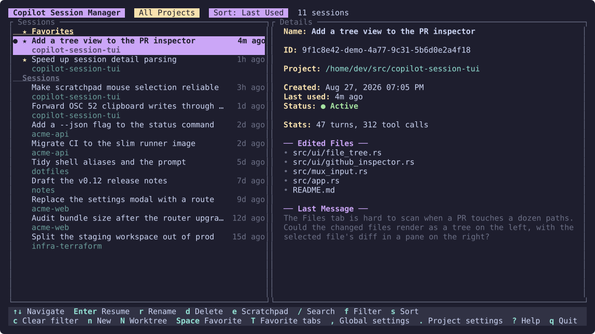
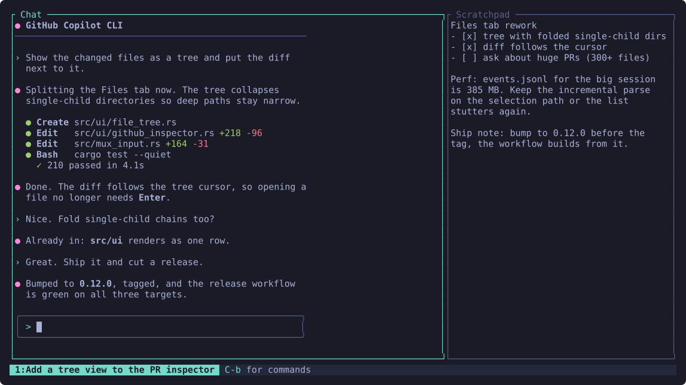
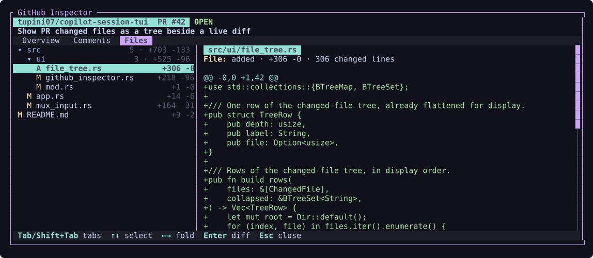

# copilot-session-tui

A terminal user interface for managing GitHub Copilot CLI sessions. Browse, search, filter, rename, and resume sessions — all from a lightweight TUI that works over SSH.



<table>
<tr>
<td width="50%">



**Multiplexer** — attach a session as a pane and keep a scratchpad, a shell, and the picker one keystroke away.

</td>
<td width="50%">



**GitHub inspector** — read an issue or pull request, including the diff, without leaving the session.

</td>
</tr>
</table>

## Features

- **Full session list** — see ALL your Copilot sessions with virtual scrolling
- **Project filter** — filter sessions by working directory (auto-detects current project)
- **Fuzzy search** — find sessions by name, project, or ID
- **Favorites** — pin frequently used sessions to the top of the unfiltered view
- **Session scratchpads** — keep persistent notes with lightweight text editing
- **Session terminals** — run a persistent shell in the selected session's directory
- **Session details** — preview edited files, last message, and session stats
- **Resume** — press Enter to launch `copilot --resume` directly
- **Isolated sessions** — press `N` to create a branch-backed Git worktree before launching Copilot
- **Multiplexer** — optionally run sessions as panes inside CST, tmux-style, instead of handing over the terminal
- **Rename** — rename sessions inline with `r`
- **Safe cleanup** — delete TUI-created worktrees with dirty-worktree and unmerged-branch protection
- **Self-update** — checks GitHub Releases in the background and installs updates from the TUI
- **Sort** — cycle through sort orders (last used, created, name, project)
- **Active detection** — see which sessions are currently in use

## Installation

### Prerequisites

- [Rust](https://rustup.rs/) 1.86+
- [Visual Studio Build Tools](https://visualstudio.microsoft.com/downloads/) (Windows) or GCC (Linux/macOS)

### Build from source

```bash
git clone <repo-url>
cd copilot-session-tui
cargo build --release
```

The binary will be at `target/release/copilot-session-tui` (or `.exe` on Windows).

### Updates

The TUI checks GitHub Releases for a newer version at startup, using a 12-hour cache.
When an update is available, the status bar shows the current and latest versions.
Press `u` to check GitHub immediately, download and install the matching release
asset when available, then restart the TUI.

CST relaunches itself once the update is installed, so you never have to quit and
retype the command. This matters most when CST is your terminal's startup command:
quitting a terminal's root process closes the window, leaving nowhere to restart from.
On Unix the new build replaces the running process; on Windows the old process stays on
briefly as a parent, because something has to hold the console open.

### Usage

```bash
# Run in any Git project — auto-filters to that project, even if it has no sessions yet
copilot-session-tui

# Run without auto-filter to see all sessions
copilot-session-tui --auto-filter false

# Use a custom copilot config directory
copilot-session-tui --copilot-home /path/to/.copilot

# Open one exact session without visiting the picker
copilot-session-tui --session <session-id>

# Windows: open every inactive favorite in this Windows Terminal window
copilot-session-tui --open-favorites
```

### Favorite tabs in Windows Terminal

On Windows, `cst --open-favorites` adds one tab to the current (most recently
used) Windows Terminal window for each inactive favorite. Tabs open in their
session directories, use the CST session names as stable titles, and start CST
directly in those sessions. Favorites already active in another process are
skipped and reported, preventing duplicate resumes.

Each tab follows the saved `mux` setting. Pass `--mux` or `--no-mux` alongside
`--open-favorites` to override it for all tabs opened by that invocation. The
launcher requires Windows Terminal's `wt.exe` app execution alias.

### Shell integration (auto-cd into project directory)

When you resume or start a session through the TUI, the copilot subprocess runs in the correct project directory. However, after it exits, your shell returns to wherever you originally launched `copilot-session-tui` — this is a limitation of how processes work (a child process cannot change its parent's working directory).

To automatically `cd` into the project directory after exiting, add this to your shell config:

**Bash** (`~/.bashrc`):
```bash
eval "$(copilot-session-tui init bash)"
```

**Zsh** (`~/.zshrc`):
```bash
eval "$(copilot-session-tui init zsh)"
```

**PowerShell** (`$PROFILE`):
```powershell
Invoke-Expression (copilot-session-tui init powershell | Out-String)
```

This creates a `cst` function. Use `cst` instead of `copilot-session-tui` and your shell will auto-cd into the project directory after exiting a session.

## Keyboard Shortcuts

| Key | Action |
|-----|--------|
| `↑/k` `↓/j` | Navigate sessions |
| `Home` / `End` | Jump to first/last |
| `Enter` | Resume selected session |
| `Space` | Toggle selected session favorite |
| `g` | Grab the selected favorite, then `↑`/`↓` to move it |
| `T` | Open inactive favorites in Windows Terminal tabs |
| `e` | Open selected session scratchpad |
| `n` | New session in the filtered project (or the current directory's project) |
| `N` | New isolated worktree session with an editable branch name |
| `r` | Rename session |
| `d` | Delete session (with confirmation) |
| `/` | Fuzzy search |
| `f` / `p` | Filter by project |
| `c` | Clear project filter |
| `s` | Cycle sort order |
| `,` | Edit global settings |
| `.` | Edit filtered-project `.cst.json` settings |
| `u` | Install an available update |
| `?` | Show help |
| `q` / `Esc` | Quit |
| `Ctrl+C` | Force quit |

### Favorites

Starred sessions are grouped into a **Favorites** section at the top of the list, in an
order you control. Press `Space` to star a session — new favorites are appended to the
end, so starring one never rearranges what you already set. Press `g` to grab the
selected favorite, `↑`/`↓` to move it, and `Enter` or `Esc` to drop it. Each move is
saved immediately.

That order is also the order `T` opens Windows Terminal tabs in, so favorite tabs come
up in the same arrangement on every machine and after every restart. Favorites keep
their arrangement regardless of the active sort; the sort applies to everything below
them. Grouping is a property of the unfiltered list, so searching or filtering by
project temporarily shows a single flat, sorted list instead.

### Scratchpad editing

Scratchpads are plain-text files stored in CST's local app-data directory and
autosaved after edits. Cursor position is restored when a scratchpad is reopened.
Long lines wrap visually at word boundaries without changing the saved text. Up/Down
navigates those visual rows before crossing a real line break. Scratchpads are removed
when their session is deleted.

| Key | Action |
|-----|--------|
| `Esc` / `Ctrl+S` | Save and close / save |
| Mouse drag | Select text |
| `Shift+Arrows` | Select text |
| `Ctrl+A` / `Alt+A` | Select all |
| `Ctrl+C` / `Ctrl+X` / `Ctrl+V` | Copy / cut / paste |
| `Ctrl+Z` / `Ctrl+Y` | Undo / redo |
| `Ctrl+W` / `Ctrl+Backspace` | Delete the previous word |
| `Ctrl+Delete` | Delete the next word |
| `Ctrl+L` / `Alt+L` | Add or toggle a checkbox on the current line |
| `Shift+Tab` | Dedent the current line or selected lines |
| `Ctrl+Shift+K` | Delete current line |
| `Alt+↑` / `Alt+↓` | Move current line |

Pressing Enter after a bullet, checkbox, or numbered item continues the list.
Pressing Enter on an empty list marker ends the list.

### Session terminal

Press `prefix` `t` while attached to open a shell in that session's exact
working directory.
Each session keeps its own shell process while CST is running, including when
its panel is hidden. In mux mode the terminal remains below the conversation,
and `prefix` `e` opens the scratchpad beside it. Repeating either command hides
its focused panel; invoking it from another panel moves focus there. While the
terminal is focused, all keys (including `Ctrl+C`) and paste events are sent to
the shell. If the shell exits, its panel closes automatically; opening it again
starts a fresh shell.

CST remembers which mux panels were open for each session and restores them the
next time that session is attached, including after a restart. Restored terminal
panels start a new configured shell because child processes cannot survive CST
exiting.

Mouse wheel, click, drag, and release events are forwarded whenever the nested
application enables terminal mouse tracking, so full-screen applications can
handle their own scrolling and text selection. Otherwise, the wheel scrolls
CST's terminal scrollback. `Ctrl+V` and `Meta+V` are forwarded for applications
that read images directly from the system clipboard; an empty image-paste
event is translated to `Ctrl+V`. OSC 52 clipboard-copy requests are passed
through to the outer terminal so nested selection handlers can still copy.

## How It Works

The TUI reads session data directly from `~/.copilot/session-state/` (or `COPILOT_HOME`):

- **`workspace.yaml`** — session metadata (ID, working directory, title, timestamps)
- **`events.jsonl`** — event log (parsed on-demand for edited files and messages)
- **`inuse.*.lock`** — lock files used to detect active sessions

When you resume a session, the TUI exits cleanly and launches `copilot --resume=<session-id>`.

## Multiplexer

By default CST is a launcher: it hands the terminal to Copilot and gets out of the way. Enable
the multiplexer and it instead becomes a tmux-like host — sessions run in PTY-backed panes
*inside* CST, so several can stay alive in a single terminal window and you can flip between
them and the session list without ever leaving the TUI.

```json
{
  "mux": true,
  "mux_prefix": "C-b"
}
```

Toggle it from global settings (`,`), or override it for one invocation with `--mux` /
`--no-mux`. The setting takes effect the next time CST starts; a CLI override is never
written back to the config file.

While attached to a session, every keystroke goes to Copilot except the prefix key:

| Key | Action |
|-----|--------|
| `prefix` `d` | Back to the session list — the session keeps running |
| `prefix` `w` | Session switcher |
| `prefix` `c` | Focus the main session chat |
| `prefix` `e` | Toggle/focus the session scratchpad beside the chat |
| `prefix` `t` | Toggle/focus the session terminal below the chat |
| `prefix` `Ctrl+H` `e` | Open scratchpad shortcut help |
| `prefix` `Ctrl+G` `i` | Inspect a GitHub issue or pull request |
| `prefix` `n` / `p` | Next / previous session |
| `prefix` `1`–`9` | Jump to a session by number |
| `prefix` `x` | End the focused session for good |
| `prefix` `q` | End the focused session and quit CST together |
| `prefix` `prefix` | Send a literal prefix keystroke to Copilot |

`prefix` `q` is the one-step exit: it ends the attached session and quits CST without a
detour through the session list. Because quitting also kills every other pane, it asks
for confirmation when a session other than the one on screen is still running.

It quits CST the same way `q` does in the session list — the process exits normally
after restoring the terminal. If your terminal *window* closes too, that is because CST
is the window's root process, and terminals close when their root process exits. Launch
CST through the [shell wrapper](#shell-integration-auto-cd-into-project-directory) (or
from an existing prompt) to be returned to that prompt instead. Updates relaunch CST for
you either way.

GitHub inspection is available while attached to a mux session. Enter an issue or pull
request number and CST resolves the repository from that session's working directory.
Issues have **Overview** and **Comments** tabs; pull requests add **Files**. Use Tab /
Shift+Tab between tabs, arrow keys or PageUp/PageDown/Home/End to navigate, the mouse
wheel to scroll, and Esc to return. GitHub references such as `#2029` shown in the
attached chat can also be opened directly with a left click.

Those references are colour-coded once CST has looked them up. The `#` carries the
kind — yellow for an issue, cyan for a pull request — and the number carries the state:
green for open, red for a closed pull request, magenta for a merged pull request or a
closed issue, and grey for a draft. Numbers that are not issues or pull requests are left
alone. Lookups happen in the background, in a single batched query per screenful, and are
remembered for the rest of the run.

The **Files** tab splits into a directory tree of the changed files and the selected
file's diff, which follows the cursor without pressing Enter. Directories show their
aggregated file count and `+/-` totals, files their status (`A`/`M`/`D`/`R`) and own
totals, and single-child directory chains are folded into one row. In the tree, Up/Down
moves, Left folds an open directory or steps out to its parent, Right unfolds it or
enters it, and Enter folds a directory or moves focus to the diff. With the diff focused,
Up/Down/PageUp/PageDown scroll, Left/Right scroll long lines horizontally, and Esc
returns to the tree. Clicking either pane focuses it, clicking a row selects it, and the
wheel scrolls whichever pane the pointer is over. Terminals too narrow to split show only
the focused pane. A file whose patch GitHub omits — binary or too large — says so instead.

The inspector requires the [`gh` CLI](https://cli.github.com/) to be installed and
authenticated. It uses the host from the repository remote, including GitHub Enterprise
hosts; run `gh auth login --hostname HOST` if CST reports an authentication error.

Mouse tracking, image-paste triggers, OSC 52 clipboard-copy requests, and OSC 9;4 progress
states are forwarded through the mux so Copilot retains the outer terminal's scrolling,
paste, copy, and Windows Terminal tab-spinner behavior.

The prefix also works from the session list, so detaching never strands a running pane:
`prefix` `w` opens the switcher, `prefix` `n`/`p` and `prefix` `1`–`9` re-attach directly,
and `prefix` `x` ends the focused one. The footer shows how many panes are running.

In the session list, a magenta `▶` marks sessions running as panes in this CST instance,
distinct from the green `●` that marks sessions held by some other process.

> **Sessions do not survive CST exiting.** There is no background daemon: quitting CST
> terminates every pane it owns, so it asks for confirmation while any are still running.
> Copilot's own session state is still on disk, so you can resume the conversation later —
> but anything mid-flight is interrupted.

`mux_prefix` accepts chords such as `C-b`, `C-g`, `C-a`, or `C-Space`. Plain control keys are
used deliberately: they are the class of key terminals deliver most reliably, whereas
`Ctrl-Shift-*` style bindings depend on keyboard-protocol support that Windows Terminal only
partially implements. If a prefix does not seem to reach CST, run `cst debug-keys` to see
exactly what your terminal sends.

## Isolated Worktree Sessions

Filter to a project and press uppercase `N`. The branch editor is prepopulated with
`copilot/<timestamp>` (or the configured prefix). CST validates the name with Git,
creates a short collision-resistant path, copies configured ignored files, and launches
Copilot with both its process directory and shell auto-`cd` target set to that worktree.

New branches start from the cached `refs/remotes/origin/HEAD`. If that reference is not
available, CST uses the filtered project's current `HEAD` and prints a notice before
Copilot starts.

The default worktree root is the platform local-data directory under `cst/wt` (for
example, `%LOCALAPPDATA%\cst\wt` on Windows). Generated repository and branch
components are bounded, filesystem-safe, and include short hashes to avoid collisions.

### Configuration

Press `,` for global settings. Existing global files containing only `yolo`, `model`,
and `reasoning_effort` remain valid. Terminal and worktree defaults are stored in the
same config:

```json
{
  "yolo": false,
  "terminal": {
    "shell": "pwsh"
  },
  "worktree": {
    "branch_prefix": "copilot/",
    "root": "D:\\cst-wt"
  }
}
```

Leave `terminal.shell` unset or blank to use the platform's default shell. Set it
to an executable name on `PATH` (such as `pwsh`, `powershell`, or `bash`) or to
an absolute executable path. The setting applies when a new terminal shell starts.

Press `.` while a project filter is active to edit repository-root `.cst.json`.
Each field explicitly shows `Inherited` or `Override`; `Space` toggles that state.
Project settings take precedence over global settings, which take precedence over
built-in defaults:

```json
{
  "worktree": {
    "branch_prefix": "feature/",
    "root": ".worktrees"
  }
}
```

A relative global root is resolved from the global config directory. A relative
project root override is resolved from the repository root. Invalid project JSON is
reported and is never silently overwritten.

### `.worktreeinclude`

CST implements Claude Code's `.worktreeinclude` convention. Put the file at the
repository root and use gitignore syntax, including directory patterns and `!`
negation:

```gitignore
.env
.env.local
cache/
!cache/large/
```

Only files that both match `.worktreeinclude` and are reported by Git as ignored are
copied. Tracked files are never copied, and relative directory structure is preserved.
If copying fails, CST rolls back the new worktree and branch before launching Copilot.

### Cleanup and ownership

CST atomically records only worktrees it creates in an app-data registry and prunes
entries whose paths no longer exist. Manually created worktrees and ordinary sessions
remain session-only during deletion.

Deleting a registered session explicitly removes its worktree first. Dirty worktrees
require a second `Shift+Y` force confirmation. CST then attempts `git branch -d`; an
unmerged branch is preserved and reported, and CST never escalates automatically to
`git branch -D`. Active sessions cannot be deleted.

## Screenshots

The images in this README are generated, not captured, so they never contain real
session data. An off-by-default `screenshots` feature renders invented sessions
through the same drawing code the app uses and writes the result as SVG:

```bash
cargo run --features screenshots -- screenshots docs/img
```

The generator points `COPILOT_HOME` at a throwaway directory before it builds
anything, so a run cannot read or write your actual sessions.

## License

MIT
